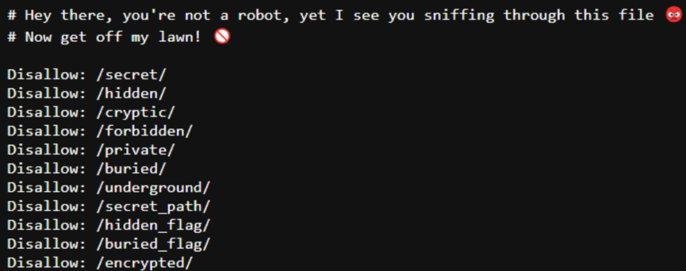

## BuriedDeep - Web

### Question
"I’m not a hacker. I’m just someone who wants to make the world a little better. But the world isn’t
going to change itself."
The flag content should be in lowercase letters only.

### Approach

I checked the /robots.txt of the website to find



I then checked for script and css files,
then i found a #flag{} section in the CSS file,
there was the 3rd part of the flag encoded with ROT 47
after decrypting, i got ```7h3_53cr3t5_4r3_bur13d}```

then i checked the disallowed paths one by one which were in robots.txt

in the /buried path, found some ASCII which after decoding, gave me the first part of the flag
```ACECTF{1nf1l7r471ng_7h3_5y573m_1```

then in the /secret_path got a morsecode which gave the 2nd part after decoding
```15_345y_wh3n_y0u_kn0w_wh3r3_```


### **Flag**
```
ACECTF{1nf1l7r471ng_7h3_5y573m_15_345y_wh3n_y0u_kn0w_wh3r3_7h3_53cr3t5_4r3_bur13d}
```