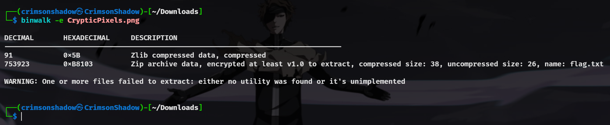
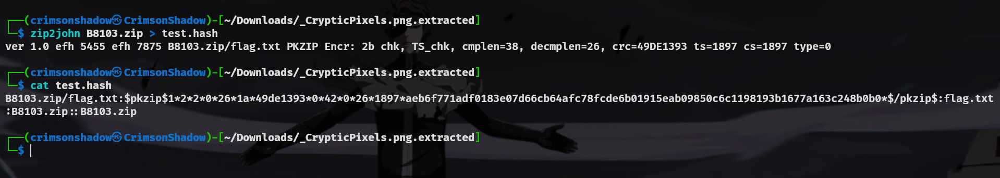
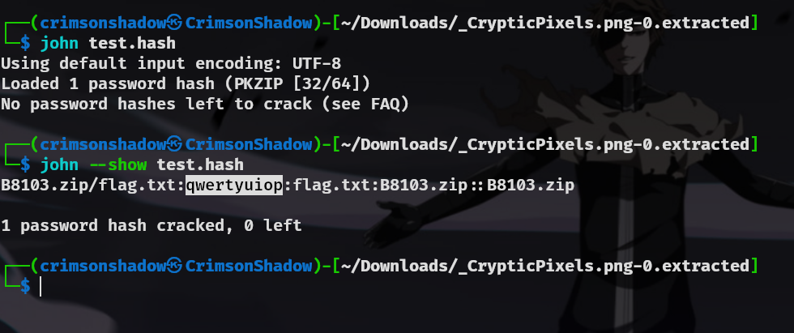
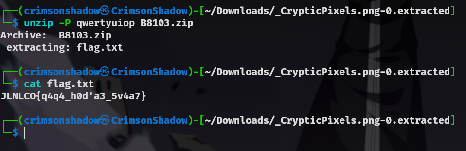
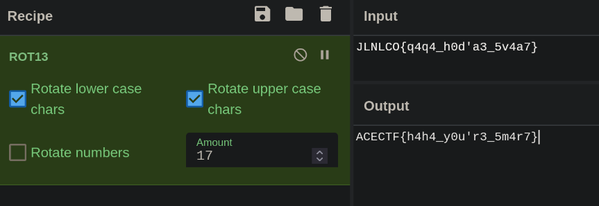

### Description:

This image looks normal at first, but something important is hidden inside. The secret is carefully concealed, making it hard to find.
Your task is to explore the image, uncover the hidden message, and reveal what’s concealed.
Do you have what it takes to crack the code and unlock the secret?

### Steps :
Use Binwalk to extract files from the png



Use zip2john to create hash



use johntheripper to find the password



extract zip file to get the encrypted flag



use caesar cipher to decipher the flag



### Flag

```ACECTF{h4h4_y0u'r3_5m4r7}```